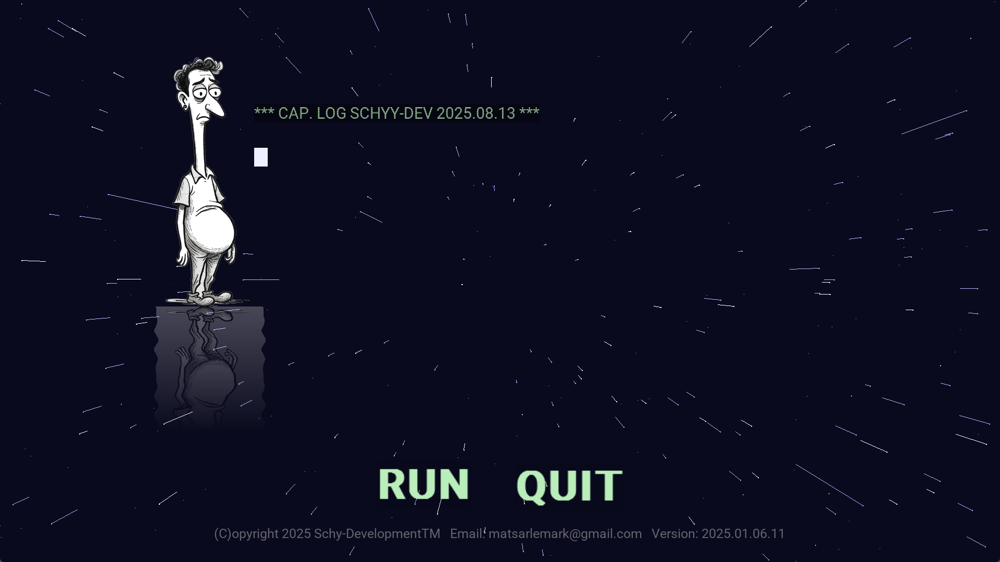
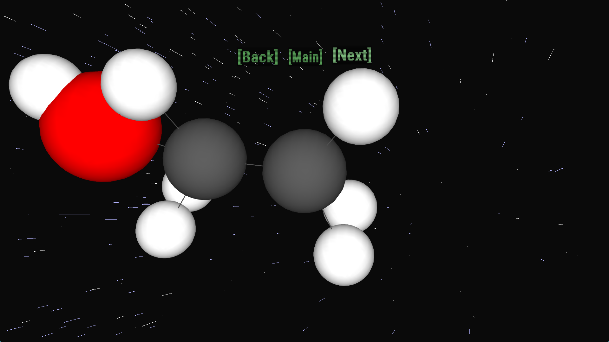

# Portfolio Menu System

A retro-flavoured C++ portfolio demo built with SDL2 and OpenGL. It mixes a starfield menu, C64-inspired text rendering, music, sound effects, shader experiments, wireframe/plasma visuals, a Mandelbrot zoom, and small interactive demo scenes.





## Features

- SDL2-based windowing, rendering, audio, image loading, and font rendering.
- OpenGL/GLEW effects for shader-driven visuals.
- Animated main menu with logo reflection and retro terminal-style text.
- Portfolio mode with multiple visual effects and navigation buttons.
- Bundled audio, font, shader, image, and Windows runtime support assets.

## Project Layout

```text
.
├── assets/
│   ├── audio/
│   ├── fonts/
│   ├── images/
│   └── shaders/
├── docs/
│   ├── archive/
│   └── screenshots/
├── runtime/
│   └── windows-x64/
├── src/
│   └── portfolio_menusystem.cpp
├── portfolio_menusystem.sln
├── portfolio_menusystem.vcxproj
└── README.md
```

## Requirements

The Visual Studio project is currently configured for these local dependency paths:

```text
C:\dev\SDL2_All\SDL2-2.32.8
C:\dev\SDL2_All\SDL2_image-2.8.8
C:\dev\SDL2_All\SDL2_mixer-2.8.1
C:\dev\SDL2_All\SDL2_ttf-2.24.0
C:\dev\glew-2.1.0
```

You need Visual Studio 2022 with the C++ desktop workload, plus SDL2, SDL2_image, SDL2_mixer, SDL2_ttf, and GLEW installed at those paths or adjusted in the `.vcxproj`.

## Build

Open `portfolio_menusystem.sln` in Visual Studio 2022 and build `Release | x64`.

Or build from PowerShell:

```powershell
& 'C:\Program Files\Microsoft Visual Studio\2022\Community\MSBuild\Current\Bin\MSBuild.exe' `
  portfolio_menusystem.sln `
  /p:Configuration=Release `
  /p:Platform=x64 `
  /m
```

## Run

Run the executable from the repository root so relative asset paths resolve correctly:

```powershell
$env:PATH = "C:\dev\SDL2_All\SDL2-2.32.8\lib\x64;" +
            "C:\dev\SDL2_All\SDL2_image-2.8.8\lib\x64;" +
            "C:\dev\SDL2_All\SDL2_mixer-2.8.1\lib\x64;" +
            "C:\dev\SDL2_All\SDL2_ttf-2.24.0\lib\x64;" +
            "C:\dev\glew-2.1.0\bin\Release\x64;" +
            ".\runtime\windows-x64;" +
            $env:PATH

.\x64\Release\portfolio_menusystem.exe
```

## Controls

- Click `RUN` to enter the portfolio demo.
- Click `[Back]`, `[Main]`, or `[Next]` in portfolio mode to navigate.
- Press `Esc` to return to the menu or exit from the menu.
- Some mini-scenes use arrow keys or `R`/`Space` when active.

## Notes

This is a learning/demo project, not a polished engine. The code intentionally keeps the experiment in a single C++ file for now, while the repository structure separates source, assets, documentation, archived patch files, and runtime support files.

## License

MIT. See [LICENSE.txt](LICENSE.txt).
